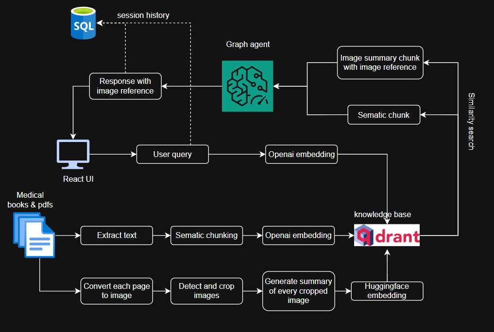

<h1 align="center">🩺 MedGPT</h1>
<p align="center">
   <em>A Medical Question-Answering System Powered by LangGraph Agents & LLMs</em>
</p>

<p align="center">
  
  
  
  
  
  
</p>

---

## 📖 Overview
**MedGPT** is a **medical question-answering system** designed to help **healthcare professionals, researchers, and medical students** quickly access accurate medical information.  
It leverages **LangGraph agents**, advanced **Large Language Models (LLMs)**, and a **vector database** to deliver precise answers on topics such as diseases, treatments, drugs, and medical procedures.

---

## ✨ Features

### 🔹 Backend
- 🧠 **Medical Knowledge Base** – Powered by **Qdrant Vector DB** for efficient storage & retrieval.
- 🤖 **Multi-Model LLM Support** – Works with **Azure OpenAI GPT**, **Google Gemini**, **DeepSeek**, **LLaMA**, and more.
- 🗂 **Structured Data Storage** – Uses **SQLite** for session history & user info.

### 🔹 Frontend
- 🎨 **User-Friendly UI** – Built with **React** for a seamless and responsive experience.
- ⚡ **Fast & Interactive** – Powered by **Vite** for blazing-fast performance.

---

## 🏗 Architecture
<p align="center">
  
</p>

---

## 🚀 Demo

The application is designed to be intuitive and user-friendly, allowing users to ask medical questions and receive accurate answers in real-time. Below is a demonstration of the application's capabilities:

<p align="center">
  
</p>

## ⚙️ Backend Installation & Setup

#### 1️⃣ Clone the repository
```bash
   git clone https://github.com/Berlinbenilo/med_gpt.git
   cd med_gpt
```

#### 2️⃣ Create and activate virtual environment
```bash
   python -m venv venv
   source venv/bin/activate   # Mac/Linux
   venv\Scripts\activate      # Windows
```

#### 3️⃣ Install dependencies
```bash
   pip install -r requirements.txt
```
#### 4️⃣ Create .env in the root folder:
```bash
   OPENAI_API_KEY="your_openai_api_key" 
   GOOGLE_API_KEY="your_google_api_key"
   FIREWORKS_API_KEY="your_fireworks_api_key"
   AZURE_OPENAI_API_KEY_CHAT="your_azure_openai_api_key"
   AZURE_OPENAI_ENDPOINT_CHAT="your_azure_openai_endpoint"
   QDRANT_HOST="localhost"
   QDRANT_PORT=6333
```
Note: At least one API key (OPENAI_API_KEY or GOOGLE_API_KEY) is required.

#### 5️⃣ Start the backend server
```bash
   uvicorn app.main:app --reload
```

## 💻 Frontend Installation & Setup

#### 1️⃣ Navigate to the frontend directory
```bash
  cd frontend
```
#### 2️⃣ Install dependencies
```bash
  npm install
```
#### 3️⃣ Create .env in frontend:
```bash
  VITE_BACKEND_URL="http://localhost:8000"  # Adjust if your backend is running on a different port
```
#### 4️⃣ Start the frontend server
```bash
  npm run dev
```
#### 5️⃣ Open your browser and go to
```bash
  http://localhost:5173
```

## 📚 Usage
1. **Ask Questions**: Type your medical question in the input box.
2. **Receive Answers**: Get accurate responses powered by LLMs.
3. **Explore Topics**: Browse through related medical topics and information.

## 🛠 Technologies Used

| Category     | Technologies                                 |
| ------------ | -------------------------------------------- |
| **Frontend** | React, Vite                                  |
| **Backend**  | FastAPI, LangGraph                           |
| **Database** | Qdrant, SQLite                               |
| **LLMs**     | Azure OpenAI, Google Gemini, DeepSeek, LLaMA |

## 📄 License
This project is licensed under the [MIT License](LICENCE.md).

## Upcoming Features
- Image reference for medical topics is under development.
- Support for more LLMs and medical databases.